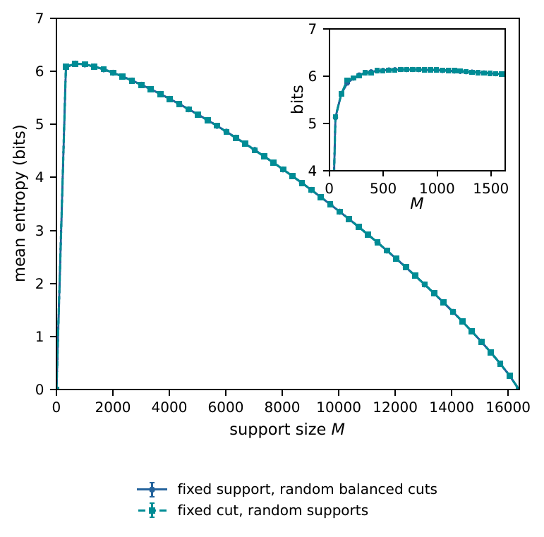
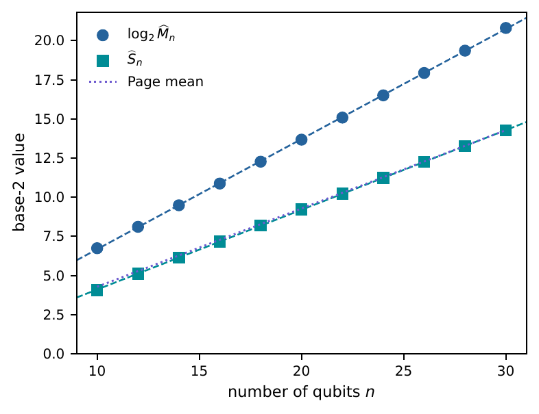
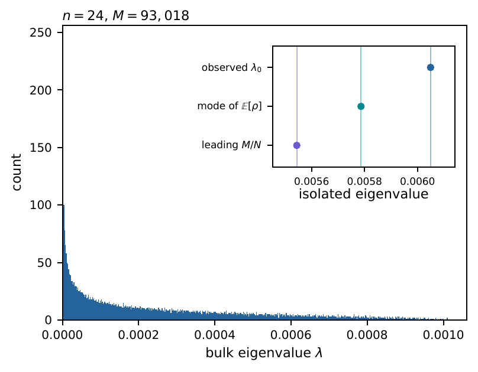
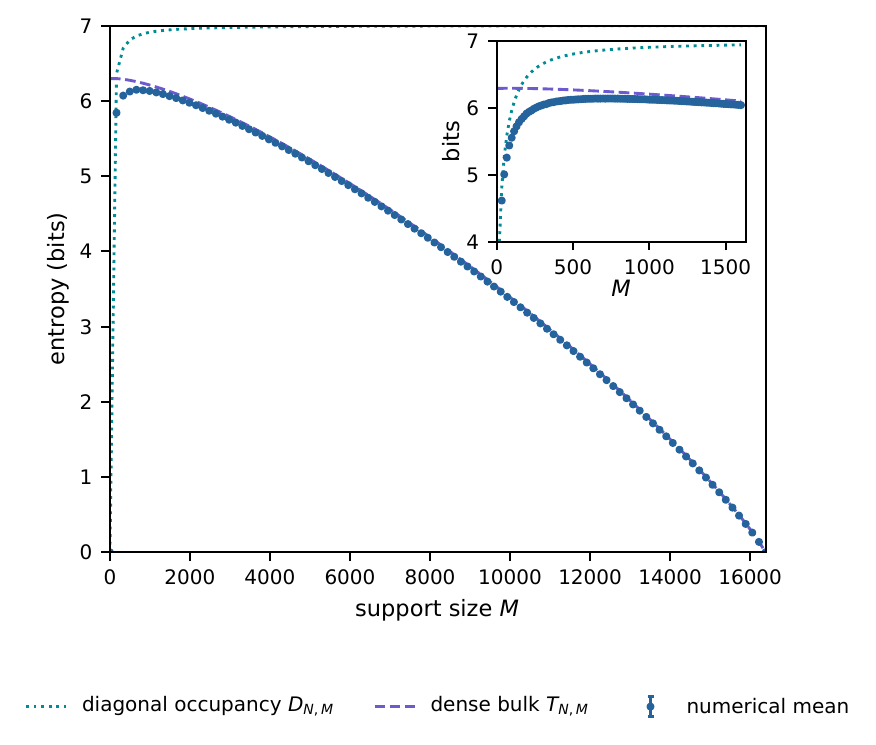
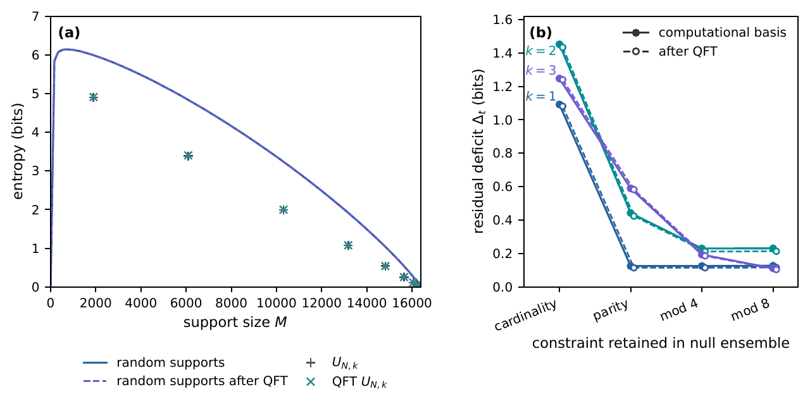
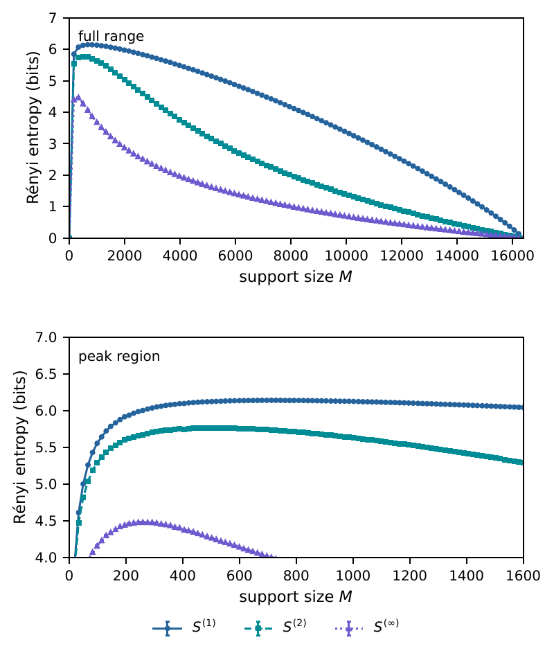
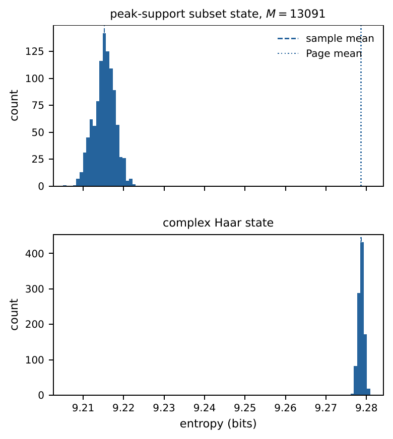

# Support-size entanglement trajectories of random subset states

**Ruge Lin**  
Thrust of Artificial Intelligence, Information Hub,  
The Hong Kong University of Science and Technology (Guangzhou), China

**Germán Sierra**  
Instituto de Física Teórica UAM-CSIC, Universidad Autónoma de Madrid, Spain

**José I. Latorre**  
Centre for Quantum Technologies, National University of Singapore, Singapore

> **Repository edition — 23 September 2026.** This is the complete Markdown conversion of the revised manuscript dated 21 August 2026, with its original section, equation, figure, table, and reference numbering. The [integration record](paper/INTEGRATION.md) documents source identity and coverage. Explicit repository audit notes qualify historical numerical claims and data availability. In particular, the $n=10\text{–}30$ peak estimates are retained historical values; the original global searches have not been independently reconstructed. Novelty and the asymptotic entropy-maximizing support remain open, as detailed in the [sanity check](docs/SANITY_CHECK.md).

<a id="abstract"></a>

## Abstract

Equal-amplitude subset states are constrained by small Schmidt rank when their support is sparse, but approach a coherent product direction when their support becomes dense. We study this competition for uniformly random supports of fixed cardinality $M$ in an $n$-qubit computational basis of dimension $N=2^n$. We derive the exact ensemble-mean reduced state and an exact formula for the average purity across a balanced bipartition. At the support scale that optimally balances the two purity corrections,

<a id="abstract-purity-scale"></a>

```math
M=2^{-1/3}N^{2/3}+O(1),
```

the fixed-cardinality ensemble satisfies

<a id="abstract-entropy-bound"></a>

```math
\overline{S}_{N,M}\geq\frac n2-1-o(1),
```

so a vanishing fraction of the basis can produce average entanglement within asymptotically one bit of the maximum. The released sampled trajectories exhibit a rise–peak–fall pattern: the von Neumann entropy vanishes at single and full support and reaches a broad intermediate maximum. Retained historical estimates of the peak mean entropy approach the balanced Page value as $n$ increases from $10$ to $30$. Over this range, the estimated peak support grows exponentially while occupying a decreasing fraction of the basis. An exact hypergeometric diagonal-entropy bound and a dense separated-mode ansatz explain the sparse and dense sides of the trajectory. As an application, we use cardinality- and residue-matched random ensembles to separate support-size, low-order congruence, and residual arrangement effects in almost-prime subset states, before and after a quantum Fourier transform.

**Keywords:** subset states; entanglement entropy; random quantum states; fixed-cardinality ensembles; random matrices; almost-prime states

## Contents

- [Abstract](#abstract)
- [1. Introduction](#sec-introduction)
- [2. Subset states and the fixed-cardinality ensemble](#sec-model)
- [3. Exact moments and compressed-support entanglement](#sec-exact-moments)
- [4. Support-size entanglement trajectory](#sec-trajectory)
- [5. Sparse-to-dense spectral mechanism](#sec-spectral-mechanism)
- [6. Structured supports and Fourier comparison](#sec-structured)
- [7. Conclusions](#sec-conclusions)
- [Data availability](#data-availability), [acknowledgements](#acknowledgements), and [conflict of interest](#conflict-of-interest)
- [Appendix A. Rényi-entropy trajectories](#app-renyi)
- [Appendix B. Entropy distributions over balanced cuts](#app-partitions)
- [Appendix C. Combinatorial derivations](#app-combinatorial-derivations)
- [Appendix D. Residue-class bound and constrained ensembles](#app-residue-proof)
- [References](#references)

**Notation.** Formulas use GitHub-native display and inline mathematics within Markdown. A bar denotes an ensemble mean, a hat a numerical estimate. Logarithms are base $2$ unless written $\ln$. Equation references link directly to their numbered displays.

<a id="sec-introduction"></a>

## 1. Introduction

At support size $M=1$, an equal-amplitude subset state is a computational-basis product state. At full support $M=2^n$, it is again a product state, $\lvert+\rangle^{\otimes n}$. Between these endpoints, however, a support of size $2^{n/2}$ can be arranged as a permutation matrix across a balanced cut and produce exactly maximal entanglement. This elementary contrast poses the question studied here: for a support chosen uniformly at random, how does bipartite entanglement depend on the number of occupied basis labels?

A subset state has the form

<a id="eq-1"></a>

```math
\lvert A\rangle = \frac{1}{\sqrt{\lvert A\rvert}}\sum_{x\in A}\lvert x\rangle,
\qquad\text{(1)}
```

so all randomness is carried by the support $A$; there are no random phases or amplitude fluctuations. Subset states were introduced as a restricted witness family in quantum complexity theory [[1]](#ref-1) and have recently become central examples in pseudorandomness and pseudoentanglement [[2]](#ref-2), [[3]](#ref-3), [[4]](#ref-4), [[5]](#ref-5). Those works ask whether suitable ensembles can be computationally or information-theoretically difficult to distinguish from Haar-random states. Our question is complementary and structural: before any indistinguishability criterion is imposed, what entanglement is generated by support placement alone?

For unrestricted random pure states, typical balanced subsystems are nearly maximally entangled. Exact mean formulas were obtained through purity and entropy calculations [[6]](#ref-6), [[7]](#ref-7), [[8]](#ref-8), and concentration results explain why high entanglement is generic in large Hilbert spaces [[9]](#ref-9). The associated reduced states are standard induced random matrices, with well-developed spectral descriptions [[10]](#ref-10), [[11]](#ref-11), [[12]](#ref-12). Support-constrained states need not follow the same reference. In particular, sparse random states can reach volume-law or Page-like entanglement while occupying only a vanishing part of Hilbert space, with the answer depending on the support and coefficient statistics [[13]](#ref-13). Equal-positive-amplitude subset states add a further coherent constraint: as the support becomes dense, constructive overlaps drive the state toward the uniform product vector. This produces a descending branch absent from models with independent random occupied amplitudes.

We first compute the ensemble-mean reduced state and the exact average purity by counting occupied rectangles in the bipartite support matrix. For a power-law support $M=cN^\gamma$, the resulting terms define a near-maximal window $1/2<\gamma<3/4$: $\gamma=2/3$ is the optimal interior balance, while $\gamma=3/4$ is the dense-side boundary. We then examine the finite-size von Neumann trajectory numerically. The released sampled trajectories show a broad intermediate maximum, and retained historical peak estimates for even $n=10,\ldots,30$ approach the balanced Page benchmark while occupying a shrinking fraction of the basis. The exact first moment, a hypergeometric occupancy bound, and a separated-mode random-matrix ansatz explain the sparse rise and dense decline.

A second purpose of the fixed-cardinality ensemble is to provide a controlled reference for structured supports. Typical entanglement depends on the sector or manifold from which random states are drawn; particle-number and symmetry constraints can substantially modify the appropriate Page-type benchmark [[14]](#ref-14), [[15]](#ref-15), [[16]](#ref-16), [[17]](#ref-17), [[18]](#ref-18). We apply the same principle to almost-prime supports. A cardinality-matched ensemble first removes the dominant effect of support size, and residue-matched ensembles then remove elementary congruence populations visible in the binary encoding. This hierarchy turns the random trajectory into a diagnostic that separates support-size, low-order congruence, and residual arrangement effects. The application connects with quantum states built from primes and almost primes [[19]](#ref-19), [[20]](#ref-20), [[21]](#ref-21), while keeping the random subset-state problem as the main subject of the paper.

<a id="sec-model"></a>

## 2. Subset states and the fixed-cardinality ensemble

For any positive integer $K$, write

<a id="eq-2"></a>

```math
[K]_0 := \{0,\ldots,K-1\}.
\qquad\text{(2)}
```

Let $N=2^n$, with $n$ even, and let

<a id="eq-3"></a>

```math
A\subseteq[N]_0,\qquad \lvert A\rvert=M.
\qquad\text{(3)}
```

The associated equal-positive-amplitude subset state is

<a id="eq-4"></a>

```math
\lvert A\rangle = \frac{1}{\sqrt M}\sum_{x\in A}\lvert x\rangle.
\qquad\text{(4)}
```

The two extreme cardinalities are product states:

<a id="eq-5"></a>

```math
M=1\quad\Longrightarrow\quad\lvert A\rangle=\lvert x\rangle,
\qquad\text{(5)}
```

and

<a id="eq-6"></a>

```math
M=N\quad\Longrightarrow\quad\lvert A\rangle=\frac{1}{\sqrt N}\sum_{x=0}^{N-1}\lvert x\rangle=\lvert+\rangle^{\otimes n}.
\qquad\text{(6)}
```

Set

<a id="eq-7"></a>

```math
d=2^{n/2}=\sqrt N
\qquad\text{(7)}
```

and use the balanced decomposition

<a id="eq-8"></a>

```math
\mathcal{H}^{(n)}=\mathcal{H}_L\otimes\mathcal{H}_R,\qquad\dim\mathcal{H}_L=\dim\mathcal{H}_R=d.
\qquad\text{(8)}
```

Unless stated otherwise, the right subsystem contains the $n/2$ least significant qubits. Each computational label is then identified with a pair $x=(a,b)\in[d]_0\times[d]_0$. Define the binary support matrix $X_A\in\{0,1\}^{d\times d}$ by

<a id="eq-9"></a>

```math
(X_A)_{ab}=\mathbf 1[(a,b)\in A]
\qquad\text{(9)}
```

and the normalized coefficient matrix

<a id="eq-10"></a>

```math
C_A=\frac{X_A}{\sqrt M}.
\qquad\text{(10)}
```

The state is

<a id="eq-11"></a>

```math
\lvert A\rangle=\sum_{a,b=0}^{d-1}(C_A)_{ab}\lvert a\rangle_L\lvert b\rangle_R.
\qquad\text{(11)}
```

Since $C_A$ has real entries, its right reduced density matrix is

<a id="eq-12"></a>

```math
\rho_A^R=C_A^\dagger C_A=\frac{X_A^\dagger X_A}{M}.
\qquad\text{(12)}
```

We measure entanglement in bits,

<a id="eq-13"></a>

```math
S(A):=-\mathrm{Tr}\!\left(\rho_A^R\log_2\rho_A^R\right).
\qquad\text{(13)}
```

The nonzero spectrum is the same if the other half is traced out [[22]](#ref-22), [[23]](#ref-23).

The support constraint itself does not prevent maximal balanced entanglement. If $M=d$ and $X_A$ is a permutation matrix, then

<a id="eq-14"></a>

```math
\rho_A^R=\frac{I_d}{d},\qquad S(A)=\log_2d=\frac n2.
\qquad\text{(14)}
```

This permutation-support family includes the rainbow pairing familiar from inhomogeneous spin-chain constructions [[24]](#ref-24), [[25]](#ref-25). Together with [Eq. (6)](#eq-6), it shows that support size cannot impose a monotone entanglement law.

For the random ensemble, $A$ is sampled uniformly from the $\binom NM$ supports of cardinality $M$. We write

<a id="eq-15"></a>

```math
\overline{S}_{N,M}:=\mathbb{E}_A S(A).
\qquad\text{(15)}
```

The uniform support law is invariant under qubit permutations, so the ensemble mean is the same for every balanced choice of left and right qubits, although a fixed support can have cut-dependent entropy.

Numerical estimates of the peak support and peak mean entropy are denoted by $\widehat M_n$ and $\widehat S_n$. The hats distinguish them from exact maximizers of $\overline{S}_{N,M}$.

<a id="sec-exact-moments"></a>

## 3. Exact moments and compressed-support entanglement

Although fixing the support cardinality correlates the entries of $X_A$, the first moment of the reduced state and the average purity can be evaluated exactly. Multi-copy moment operators of fixed-size random subset states have also been analyzed in recent pseudorandomness work [[5]](#ref-5), [[4]](#ref-4). Here the balanced bipartition and support-matrix geometry lead to especially direct closed formulas for the ensemble-mean reduced state and the ensemble-average purity. For a cell $i=(a,b)$, write $X_i=\mathbf 1[i\in A]$. If $i_1,\ldots,i_r$ are distinct cells, uniform sampling without replacement gives

<a id="eq-16"></a>

```math
\begin{aligned}
\mathbb{E}_A\!\left[\prod_{j=1}^{r}X_{i_j}\right]&=\frac{(M)_r}{(N)_r},\\
(x)_r&=x(x-1)\cdots(x-r+1).
\end{aligned}
\qquad\text{(16)}
```

This factorial-moment identity is the only combinatorial input needed below.

### 3.1. Mean reduced state

<a id="prop-mean-reduced-state"></a>

**Proposition 3.1 (Mean reduced state).** For every $1\leq M\leq N$, the ensemble-mean reduced state is

<a id="eq-17"></a>

```math
\begin{aligned}
\mathbb{E}_A\rho_A^R&=\left(\frac1d-\beta_{N,M}\right)I_d+\beta_{N,M}J_d,\\
\beta_{N,M}&=\frac{M-1}{d(N-1)},
\end{aligned}
\qquad\text{(17)}
```

where $J_d$ is the all-ones matrix. Its uniform-mode eigenvalue is

<a id="eq-18"></a>

```math
\lambda_{\mathrm{mf}}(N,M)=\frac1d+\frac{(d-1)(M-1)}{d(N-1)},
\qquad\text{(18)}
```

and its orthogonal eigenvalue is

<a id="eq-19"></a>

```math
\lambda_{\perp}(N,M)=\frac1d-\frac{M-1}{d(N-1)},
\qquad\text{(19)}
```

with multiplicity $d-1$.

**Proof.** From [Eq. (12)](#eq-12),

<a id="eq-20"></a>

```math
(\rho_A^R)_{bb'}=\frac1M\sum_{a=0}^{d-1}X_{ab}X_{ab'}.
\qquad\text{(20)}
```

For $b=b'$, each summand has expectation $M/N$, hence $\mathbb{E}_A(\rho_A^R)_{bb}=1/d$. For $b\neq b'$, the two cells are distinct and [Eq. (16)](#eq-16) gives

<a id="eq-21"></a>

```math
\mathbb{E}_A(\rho_A^R)_{bb'}=\frac dM\frac{(M)_2}{(N)_2}=\frac{M-1}{d(N-1)}.
\qquad\text{(21)}
```

[Equation (17)](#eq-17) follows. A matrix of the form $\alpha I_d+\beta J_d$ has eigenvalue $\alpha+d\beta$ on the uniform vector and $\alpha$ on its orthogonal complement. ∎

The subscript “mf” emphasizes that $\lambda_{\mathrm{mf}}$ is the uniform eigenvalue of the mean matrix, not an identity for $\mathbb{E}_A\lambda_{\max}(\rho_A^R)$. At $M=1$, for example, every individual reduced state is pure, whereas $\mathbb{E}_A\rho_A^R=I_d/d$. The quantity becomes a useful finite-size mean-field scale in the regime where sampled spectra develop an isolated leading coherent mode.

### 3.2. Average purity

Purity is the second Rényi moment and is a standard diagnostic of random bipartite states [[6]](#ref-6), [[10]](#ref-10). Define

<a id="eq-22"></a>

```math
P(A):=\mathrm{Tr}\!\left[(\rho_A^R)^2\right],\qquad\overline{P}_{N,M}:=\mathbb{E}_A P(A).
\qquad\text{(22)}
```

<a id="thm-average-purity"></a>

**Theorem 3.2 (Average purity).** For $N=d^2\geq4$ and $1\leq M\leq N$,

<a id="eq-23"></a>

```math
\begin{aligned}
\overline{P}_{N,M}={}&\frac1M+\frac{2(d-1)(M-1)}{M(N-1)}\\
&+\frac{(d-1)^2(M-1)(M-2)(M-3)}{M(N-1)(N-2)(N-3)}.
\end{aligned}
\qquad\text{(23)}
```

The counting mechanism is visible directly from

<a id="eq-24"></a>

```math
P(A)=\frac1{M^2}\sum_{a,a',b,b'}X_{ab}X_{ab'}X_{a' b'}X_{a' b}.
\qquad\text{(24)}
```

The four factors are the corners of an ordered rectangle. Depending on whether $a=a'$ and $b=b'$, they contain one, two, or four distinct cells. The respective numbers of ordered index quadruples are

<a id="eq-25"></a>

```math
N,\qquad 2N(d-1),\qquad N(d-1)^2.
\qquad\text{(25)}
```

Applying [Eq. (16)](#eq-16) to these three cases gives [Eq. (23)](#eq-23). The complete count, including the small-$M$ cases, is given in [Appendix C](#app-combinatorial-derivations). The endpoint checks are immediate: $\overline{P}_{N,1}=\overline{P}_{N,N}=1$.

To expose the relevant powers before choosing a particular scale, let $M_N=cN^\gamma+O(1)$ with fixed $c>0$ and $0<\gamma<1$. Expanding [Eq. (23)](#eq-23) gives

<a id="eq-26"></a>

```math
\begin{aligned}
\overline{P}_{N,M_N}={}&2N^{-1/2}+c^{-1}N^{-\gamma}+c^2N^{2\gamma-2}\\
&+o\!\left(N^{-1/2}+N^{-\gamma}+N^{2\gamma-2}\right).
\end{aligned}
\qquad\text{(26)}
```

The three displayed terms are, respectively, the balanced-cut background, the sparse $1/M$ contribution, and the four-distinct-cell rectangle contribution. The sparse term is comparable with the background at $\gamma=1/2$, while the rectangle term is comparable with it at $\gamma=3/4$.

<a id="cor-compressed-support-entropy"></a>

**Corollary 3.3 (Power-law support window and optimal balance).** Let $M_N=cN^\gamma+O(1)$ with fixed $c>0$ and $0<\gamma<1$.

If $1/2<\gamma<3/4$, then

<a id="eq-27"></a>

```math
\overline{P}_{N,M_N}=2N^{-1/2}\bigl(1+o(1)\bigr),
\qquad\text{(27)}
```

and therefore

<a id="eq-28"></a>

```math
\overline{S}_{N,M_N}\geq\frac n2-1-o(1).
\qquad\text{(28)}
```

Within this interval, the slower of the two support-dependent corrections in [Eq. (26)](#eq-26) decays fastest at $\gamma=2/3$. More precisely, for $M_N=cN^{2/3}+O(1)$,

<a id="eq-29"></a>

```math
\overline{P}_{N,M_N}=2N^{-1/2}+\left(c^{-1}+c^2\right)N^{-2/3}+O(N^{-1}),
\qquad\text{(29)}
```

and the coefficient $c^{-1}+c^2$ is minimized at $c=2^{-1/3}$. Hence, for $M_N=2^{-1/3}N^{2/3}+O(1)$,

<a id="eq-30"></a>

```math
\overline{S}_{N,M_N}\geq\frac n2-1-\frac{3}{2^{5/3}\ln2}N^{-1/6}+O(N^{-1/3}).
\qquad\text{(30)}
```

At the dense-side boundary $M_N=cN^{3/4}+O(1)$,

<a id="eq-31"></a>

```math
\overline{P}_{N,M_N}=(2+c^2)N^{-1/2}+c^{-1}N^{-3/4}+O(N^{-1}),
\qquad\text{(31)}
```

so

<a id="eq-32"></a>

```math
\overline{S}_{N,M_N}\geq\frac n2-\log_2(2+c^2)-o(1).
\qquad\text{(32)}
```

**Proof.** [Equation (26)](#eq-26) follows by inserting $M_N=cN^\gamma+O(1)$ and $d=N^{1/2}$ into [Eq. (23)](#eq-23). For $1/2<\gamma<3/4$, both support-dependent terms are $o(N^{-1/2})$. For every density matrix,

<a id="eq-33"></a>

```math
S(A)\geq S^{(2)}(A)=-\log_2P(A).
\qquad\text{(33)}
```

Since $-\log_2x$ is convex, Jensen's inequality yields

<a id="eq-34"></a>

```math
\overline{S}_{N,M}\geq\mathbb{E}_A[-\log_2P(A)]\geq-\log_2\overline{P}_{N,M}.
\qquad\text{(34)}
```

This proves [Eq. (28)](#eq-28). The decay rate of the larger support-dependent correction is governed by $\min\{\gamma,2-2\gamma\}$, which is uniquely maximized at $\gamma=2/3$. Substitution of $\gamma=2/3$ and minimization over $c$ give [Eqs. (29)](#eq-29) and [(30)](#eq-30). Substitution of $\gamma=3/4$ gives [Eqs. (31)](#eq-31) and [(32)](#eq-32). Detailed remainders are collected in [Appendix C](#app-combinatorial-derivations). ∎

<a id="remark-optimal-balance"></a>

**Remark 3.4.** At the optimal interior balance, $M_N=2^{(2/3)n+O(1)}$, so a vanishing fraction of the computational basis already gives average balanced entanglement within asymptotically one bit of the maximum. The exponent $2/3$ uniquely balances the sparse and rectangle corrections; $3/4$ instead marks the dense-side boundary, beyond which this purity lower bound loses the maximal balanced slope. These statements do not locate the maximizer of $\overline{S}_{N,M}$: minimizing average purity and maximizing average von Neumann entropy are different problems. They also concern ensemble averages; concentration is separate.

<a id="sec-trajectory"></a>

## 4. Support-size entanglement trajectory

The endpoint and permutation-support examples in [Sec. 2](#sec-model) show that the same family contains product states at $M=1$ and $M=N$ and maximally entangled states at $M=d$. They do not determine the behavior of a typical uniformly random support. Two further exact relations delimit the possible trajectory. First, the Schmidt rank cannot exceed either $M$ or $d$, so

<a id="eq-35"></a>

```math
S(A)\leq\log_2\!\bigl(\mathrm{rank}C_A\bigr)\leq\min\!\left\{\log_2 M,\frac{n}{2}\right\}.
\qquad\text{(35)}
```

Second, every subset state has overlap

<a id="eq-36"></a>

```math
\left|\langle +^{\otimes n}\mid A\rangle\right|^2=\frac{M}{N}
\qquad\text{(36)}
```

with the full-support product state. Sparse supports are therefore constrained by rank, whereas dense supports acquire increasing weight in the coherent uniform direction.

<a id="subsec-numerical-protocol"></a>

### 4.1. Numerical protocol

Unless stated otherwise, the numerical calculations use the natural balanced cut, with the low-order $n/2$ bits assigned to the right subsystem. A support is drawn uniformly without replacement from $[N]_0$. If $\sigma_j(C_A)$ are the singular values of the coefficient matrix, then the nonzero reduced-state eigenvalues are

<a id="eq-37"></a>

```math
\lambda_j=\sigma_j(C_A)^2,
\qquad\text{(37)}
```

and the entropy is evaluated as

<a id="eq-38"></a>

```math
S(A)=-\sum_{\lambda_j>0}\lambda_j\log_2\lambda_j.
\qquad\text{(38)}
```

Using singular values avoids constructing both reduced matrices and is stable for the positive semidefinite spectrum.

At fixed $(N,M)$, independent supports $A_1,\ldots,A_R$ give the Monte Carlo estimator

<a id="eq-39"></a>

```math
\widehat{\overline S}_{N,M}=\frac{1}{R}\sum_{r=1}^{R}S(A_r).
\qquad\text{(39)}
```

Error bars on sampled mean trajectories show the standard error $\frac{s_R}{\sqrt R}$, where $s_R$ is the sample standard deviation. Figure captions state when the average is instead over balanced cuts of one fixed support.

For comparison with unrestricted random pure states, the exact Page mean for a balanced $d\times d$ bipartition is

<a id="eq-40"></a>

```math
\begin{aligned}
S_{\mathrm{Page}}(n)
&=\frac{\mathcal H_{d^2}-\mathcal H_d-\frac{d-1}{2d}}{\ln 2} \\
&=\frac{n}{2}-\frac{1}{2\ln 2}+O(2^{-n}),
\end{aligned}
\qquad\text{(40)}
```

where $\mathcal H_k:=\sum_{j=1}^{k}j^{-1}$ [[7]](#ref-7), [[8]](#ref-8).

Peak estimates are obtained in two stages. A coarse scan first identifies a candidate maximum region. Mean entropies in a local support-size window are then fitted by a quadratic function of $x=\log_2M$; the interior maximum defines $\widehat M_n$ and $\widehat S_n$. This procedure estimates a characteristic peak scale rather than an exact integer maximizer. The support space is combinatorial, and the trajectory is broad enough near its maximum that unit-level changes in $\widehat M_n$ have no separate physical meaning.

> **Repository audit note.** This paragraph records the manuscript’s stated peak-estimation protocol. The released peak table contains historical point estimates. The original complete scan records, fit windows, and uncertainty estimates are not available in the repository, and the $n=22\text{–}30$ peak searches have not been independently replayed. The retained data permit verification of the displayed table and finite-range fits; local peak checks do not establish a global maximum. See [reproducibility limits](docs/REPRODUCIBILITY.md).

### 4.2. Rise, broad maximum, and return to the product state

[Figure 1](#fig-trajectory) compares two diagnostics at $n=14$. The first fixes the natural balanced cut and averages over independently sampled supports. The second draws one support at each $M$ and averages its entropy over random balanced cuts. The fixed-cardinality ensemble mean is cut-independent, but the second procedure is conditional on one support and therefore tests how a sampled support behaves across cuts.

<a id="fig-trajectory"></a>



**Figure 1.** Mean balanced-cut entropy of random subset states at $n=14$. The solid curve fixes one random support at each $M$ and averages over random balanced cuts; the dashed curve fixes the natural cut and averages over random supports. Full-range points use 100 samples and inset points use 500 samples. Error bars are standard errors of the displayed means. The two procedures recover the same global rise–peak–fall trajectory, with small support-specific finite-size offsets. The inset resolves the broad maximum.

Both procedures exhibit the same global pattern. The entropy rises rapidly from zero, reaches a broad maximum at an intermediate support size, and then falls smoothly to zero at full support. The close curves show that support cardinality provides a strong baseline in these samples. They do not imply that all supports, or all cuts of one support, have identical entropy.

The inset also shows why the peak position should be read as a scale rather than as a sharply distinguished integer. On the fixed-cut curve, the sampled means for $552\leq M\leq993$ remain within approximately $1.5\times10^{-2}$ bits of the largest displayed mean. The independently generated trajectory therefore identifies the same peak region as the $n=14$ estimate in [Table 1](#tab-peak-estimates), while displaying the flatness of the local profile.

The descending branch has a specifically coherent origin. Increasing $M$ does not merely increase the number of populated basis vectors: by [Eq. (36)](#eq-36), it also increases the fidelity with $\lvert +\rangle^{\otimes n}$. Near full support, this positive direction dominates and the state returns to a product state. [Section 5](#sec-spectral-mechanism) turns this observation into a spectral picture involving an isolated uniform mode and a residual bulk.

<a id="subsec-peak-scaling"></a>

### 4.3. Estimated peak and finite-size scaling

For each even $n$ in the studied range, [Table 1](#tab-peak-estimates) lists the retained historical estimates of the peak location $\widehat M_n$ and peak mean entropy $\widehat S_n$. The protocol above describes the manuscript’s stated estimation procedure; the original complete scan and fit records are unavailable. Hats are retained because the entries are numerical estimates of the ensemble peak, not exact maximizers of $\overline S_{N,M}$.

<a id="tab-peak-estimates"></a>

| $n$ | $\widehat M_n$ | $\widehat S_n$ (bits) |
|---:|---:|---:|
| 10 | 107 | 4.072 |
| 12 | 276 | 5.108 |
| 14 | 716 | 6.143 |
| 16 | 1873 | 7.176 |
| 18 | 4934 | 8.196 |
| 20 | 13091 | 9.215 |
| 22 | 34771 | 10.231 |
| 24 | 93018 | 11.242 |
| 26 | 250660 | 12.251 |
| 28 | 672556 | 13.258 |
| 30 | 1836685 | 14.263 |

**Table 1.** Estimated support size $\widehat M_n$ at the maximum of the random fixed-cardinality entropy trajectory and the corresponding estimated mean entropy $\widehat S_n$. All rows are used in the finite-size fits in [Figure 2](#fig-peak-scaling).

[Figure 2](#fig-peak-scaling) compares these estimates with the exact balanced Page mean. Least-squares fits over all eleven rows give

<a id="eq-41"></a>

```math
\begin{aligned}
    \widehat S_n
    &\simeq0.5093\,n-0.9901,\\
    \log_2\widehat M_n
    &\simeq0.70354\,n-0.35773.
\end{aligned}
\qquad\text{(41)}
```

<a id="fig-peak-scaling"></a>



**Figure 2.** Estimated peak support size and peak entropy for even $n=10,\ldots,30$. Dashed lines are the least-squares finite-size fits to $\log_2\widehat M_n$ and $\widehat S_n$ in [Eq. (41)](#eq-41); the dotted curve is the exact Page mean for a balanced bipartition. The common vertical coordinate reports base-2 values: $\widehat S_n$ and the Page mean are entropies in bits, whereas $\log_2\widehat M_n$ is the base-2 logarithm of the support size. The fits summarize the studied range and are not asserted as asymptotic laws.

Two finite-size observations are robust at the scale of the data. First, the peak entropy tracks the Page mean increasingly closely: the difference $S_{\mathrm{Page}}(n)-\widehat S_n$ decreases from about 0.21 bits at $n=10$ to about 0.016 bits at $n=30$. Second, the estimated peak occupies a shrinking fraction of the computational basis. The ratio $\widehat M_n/N$ decreases from approximately 10.4% at $n=10$ to 0.171% at $n=30$, while the second fit in [Eq. (41)](#eq-41) summarizes its exponential growth in absolute size.

The slopes in [Eq. (41)](#eq-41) are effective finite-range slopes. The Page curve has asymptotic slope $1/2$, so the fitted value 0.5093 is not evidence for entropy growth above the maximal balanced scaling. Likewise, 0.70354 is not claimed as a limiting support exponent. A second finite-size diagnostic is the pointwise ratio

<a id="eq-42"></a>

```math
\gamma_n^{\mathrm{eff}}
    :=\frac{\log_2\widehat M_n}{n}.
\qquad\text{(42)}
```

Across the retained rows it increases monotonically from approximately 0.674 at $n=10$ to 0.694 at $n=30$. Both these ratios and the fitted slope lie between the correction-balanced interior value $2/3$ and the dense-side boundary $3/4$ identified in [Corollary 3.3](#cor-compressed-support-entropy). These finite-size trends do not determine an asymptotic exponent: a finite intercept and other subleading corrections can produce the same behavior. The purity scales and the finite-size location of the von Neumann maximum remain different quantities and need not coincide.

The empirical conclusion is nevertheless strong: equal-positive-amplitude states can attain near-Page balanced entanglement while occupying an exponentially compressed support. This entanglement statement is logically distinct from pseudorandomness. The scale $M\asymp N^{2/3}$ from [Corollary 3.3](#cor-compressed-support-entropy) lies within fixed-size regimes where polynomial-copy moment averages of random subset states are known to approach their Haar counterparts [[5]](#ref-5), [[4]](#ref-4). The present work isolates the balanced-entanglement consequence and its support-size trajectory; it does not rederive those indistinguishability results.

<a id="sec-spectral-mechanism"></a>

## 5. Sparse-to-dense spectral mechanism

The exact moments above do not determine the von Neumann entropy trajectory, but they identify the two structures that govern its opposite sides. Sparse supports are limited by occupancy and rank. Dense positive supports reinforce the uniform mode of the reduced state. Between them, a broad residual spectrum carries most of the entropy.

<a id="subsec-dense-description"></a>

### 5.1. Separated mode and dense-side ansatz

[Figure 3](#fig-spectrum) shows one sampled reduced-state spectrum near the estimated peak. One eigenvalue is separated from a broad bulk. Induced random density matrices have closely related bulk descriptions [[10]](#ref-10), [[11]](#ref-11), [[12]](#ref-12), but the positive fixed-cardinality ensemble also has the coherent uniform direction identified exactly in [Proposition 3.1](#prop-mean-reduced-state).

<a id="fig-spectrum"></a>



**Figure 3.** Reduced-state spectrum for one random subset state at $n=24$ and $M=93018$, near the estimated entropy peak. The histogram contains the bulk eigenvalues after removing the largest eigenvalue $\lambda_0:=\lambda_{\max}(\rho_A^R)$. The inset compares the observed $\lambda_0$ with the exact uniform eigenvalue $\lambda_{\mathrm{mf}}$ of the ensemble-mean reduced state and with the leading approximation $M/N$. The mean-matrix mode is a finite-size mean-field scale, not an exact formula for the largest eigenvalue of each sample.

To model the dense side, we use $\lambda_{\mathrm{mf}}$ as the separated mode and approximate the remaining trace by a balanced random-matrix bulk. If the normalized residual bulk has the Page entropy $\log_2 d-\frac{1}{2\ln 2}$, then the entropy decomposes into the binary mixing entropy of the separated mode and the rescaled bulk entropy. Writing $h_2(x):=-x\log_2x-(1-x)\log_2(1-x)$, this gives the fixed-mode ansatz

<a id="eq-43"></a>

```math
\begin{aligned}
T_{N,M}={}&h_2(\lambda_{\mathrm{mf}}) \\
&+(1-\lambda_{\mathrm{mf}})
  \left(\log_2 d-\frac{1}{2\ln 2}\right),
\end{aligned}
\qquad\text{(43)}
```

with the usual endpoint convention and $\lambda_{\mathrm{mf}}=\lambda_{\mathrm{mf}}(N,M)$ from [Eq. (18)](#eq-18). This is a dense-bulk ansatz, not an exact moment formula. It uses the exact first moment of the fixed-cardinality ensemble but still assumes that the residual spectrum behaves like a normalized random bulk [[7]](#ref-7), [[26]](#ref-26).

The mean uniform mode also gives a spectral interpretation of the $3/4$ boundary. Since $N=d^2$, [Eq. (18)](#eq-18) can be written exactly as

<a id="eq-44"></a>

```math
\lambda_{\mathrm{mf}}(N,M)
    =\frac{M+d}{d(d+1)}.
\qquad\text{(44)}
```

In the dense range $M\gg d$, this is asymptotic to $M/N$. For $M=cN^\gamma$, its squared weight therefore scales as $c^2N^{2\gamma-2}$, the same power as the rectangle term in [Eq. (26)](#eq-26). At $\gamma=3/4$ this contribution is of order $N^{-1/2}$ and becomes comparable with the balanced random-matrix background at the level of the second moment. This identifies the upper boundary without asserting that the observed largest eigenvalue equals the mean-matrix mode in every sample.

<a id="subsec-sparse-description"></a>

### 5.2. Hypergeometric occupancy and the sparse side

For a fixed right-basis label $b$, let

<a id="eq-45"></a>

```math
W_b:=\sum_{a=0}^{d-1}X_{ab}
\qquad\text{(45)}
```

be the number of occupied cells in column $b$. Because the support contains exactly $M$ cells sampled from the $N=d^2$ available cells, $W_b$ is hypergeometric rather than binomial:

<a id="eq-46"></a>

```math
\Pr(W_b=w)=\frac{\binom{d}{w}\binom{N-d}{M-w}}{\binom{N}{M}},
\qquad\text{(46)}
```

where

<a id="eq-47"></a>

```math
\max(0,M-N+d)\leq w\leq\min(d,M).
\qquad\text{(47)}
```

Since $(\rho_A^R)_{bb}=W_b/M$, exchangeability of the columns gives the exact mean diagonal entropy

<a id="eq-48"></a>

```math
D_{N,M}:=-d\sum_w\Pr(W_b=w)\frac{w}{M}\log_2\!\left(\frac{w}{M}\right),
\qquad\text{(48)}
```

where the $w=0$ summand is zero.

Let $\Delta$ denote dephasing in the right computational basis. Dephasing does not decrease von Neumann entropy [[22]](#ref-22), so

<a id="eq-49"></a>

```math
S(A)
    \leq S\!\left(\Delta(\rho_A^R)\right)
    =H\!\left(\mathrm{diag}\rho_A^R\right).
\qquad\text{(49)}
```

Averaging yields the exact upper bound

<a id="eq-50"></a>

```math
\overline S_{N,M}\leq D_{N,M}.
\qquad\text{(50)}
```

The quantity $D_{N,M}$ is exact as a diagonal-entropy average. It approximates the actual entanglement only in the sparse regime, where column overlaps and the associated off-diagonal coherences remain small.

[Figure 4](#fig-approximation) displays the numerical mean together with the exact diagonal upper bound and the dense ansatz. The diagonal curve describes the initial sparse rise but becomes loose after off-diagonal overlaps proliferate. The dense ansatz captures the descending side semiquantitatively. Their complementary behavior supports a crossover interpretation rather than a single formula valid over the full support range.

<a id="fig-approximation"></a>



**Figure 4.** Mean balanced entropy of random subset states at $n=14$ compared with the exact expected diagonal entropy $D_{N,M}$ and the dense-bulk ansatz $T_{N,M}$. The quantity $D_{N,M}$ is an upper bound on the mean von Neumann entropy and is informative on the sparse side; $T_{N,M}$ uses the exact mean-matrix uniform mode and captures the descending dense-side trend semiquantitatively. Error bars on the numerical points show the standard error of the sampled mean. The inset resolves the peak region.

The mechanism is therefore simple. At small $M$, increasing the support populates more row and column sectors and enlarges the effective Schmidt support. At large $M$, positive overlaps reinforce the uniform coherent mode, which tends continuously to the product-state eigenvalue 1 at full support. The entropy maximum lies between these regimes: a broad bulk has formed, but the coherent direction has not yet become dominant. This interpretation does not by itself locate the exact maximizer.

<a id="sec-structured"></a>

## 6. Structured supports: almost-prime states and Fourier comparison

A random-state benchmark is informative only after the constraints known in advance have been specified. Typical entanglement changes when states are drawn from invariant subspaces or restricted manifolds [[14]](#ref-14), [[16]](#ref-16); particle-number, conserved-charge, and non-Abelian symmetry sectors provide concrete examples [[15]](#ref-15), [[17]](#ref-17), [[18]](#ref-18). The same principle applies to subset states. Support cardinality already has a leading entanglement effect, as also occurs in sparse random-state ensembles [[13]](#ref-13). A systematic departure from a matched random ensemble can therefore reveal organization absent from that ensemble, although it does not by itself identify a unique cause [[27]](#ref-27).

### 6.1. Residue-class entropy ceiling

Low-order residue classes have a direct entanglement consequence for the natural balanced cut. Let $\ell:=n/2$, choose $0\leq t\leq\ell$, and partition a support $A$ according to its residues modulo $2^t$:

<a id="eq-51"></a>

```math
\begin{aligned}
A_r^{(t)}&:=\{x\in A:x\equiv r\pmod{2^t}\}, \\
p_r^{(t)}&:=\frac{\lvert A_r^{(t)}\rvert}{\lvert A\rvert}.
\end{aligned}
\qquad\text{(51)}
```

The $t$ residue bits are the $t$ least significant qubits and lie in the right subsystem.

<a id="prop-residue-ceiling"></a>

**Proposition 6.1 (Residue-class entropy ceiling).** For every subset state $\lvert A\rangle$ and every $0\leq t\leq\ell$,

<a id="eq-52"></a>

```math
\begin{aligned}
S(A)&\leq \ell-t+H\!\left(\mathbf p^{(t)}\right), \\
H(\mathbf p)&:=-\sum_r p_r\log_2 p_r.
\end{aligned}
\qquad\text{(52)}
```

Consequently, if $A$ occupies at most $q$ residue classes modulo $2^t$, then

<a id="eq-53"></a>

```math
S(A)\leq \ell-t+\log_2q.
\qquad\text{(53)}
```

If a single residue class is occupied, the corresponding $t$ qubits factor from the state and $S(A)\leq \ell-t$.

The proof is given in [Appendix D](#app-residue-proof). Its main step is to dephase the $t$ residue qubits. The dephased reduced state is a direct sum whose entropy is the Shannon entropy of the residue populations plus the average within-sector entropy, and each sector has only $\ell-t$ remaining right-subsystem qubits.

The parity case $t=1$ is especially transparent. If a fraction $\varepsilon$ of the support is even, then

<a id="eq-54"></a>

```math
S(A)\leq \ell-1+h_2(\varepsilon),
\qquad\text{(54)}
```

where $h_2$ is the binary entropy. A support confined to odd labels has one right-subsystem qubit fixed and therefore loses at least one bit of possible balanced entropy.

### 6.2. Nested matched ensembles for almost-prime supports

Let $\Omega(x)$ denote the number of prime factors of $x$, counted with multiplicity, and define

<a id="eq-55"></a>

```math
\begin{aligned}
U_{N,k}&:=\{x\in\{2,\ldots,N-1\}:1\leq\Omega(x)\leq k\}, \\
M_{N,k}&:=\lvert U_{N,k}\rvert.
\end{aligned}
\qquad\text{(55)}
```

The corresponding subset state is the equal superposition over $U_{N,k}$. The case $k=1$ is the Prime state, and increasing $k$ successively adds almost primes. Prime and almost-prime quantum states were introduced and studied in Refs. [[19]](#ref-19), [[20]](#ref-20), [[21]](#ref-21); the number-theoretic terminology follows the classical almost-prime literature [[28]](#ref-28), [[29]](#ref-29).

For a deterministic support $B$, define the residue-count vector

<a id="eq-56"></a>

```math
\mathbf M_t(B):=\bigl(\lvert B_0^{(t)}\rvert,\ldots,\lvert B_{2^t-1}^{(t)}\rvert\bigr)
\qquad\text{(56)}
```

and let $\mathcal E_t(B)$ be the uniform ensemble of supports $A$ satisfying

<a id="eq-57"></a>

```math
\mathbf M_t(A)=\mathbf M_t(B).
\qquad\text{(57)}
```

The case $t=0$ matches only cardinality. The cases $t=1,2,3$ additionally match parity, residues modulo 4, or residues modulo 8. Define

<a id="eq-58"></a>

```math
\begin{aligned}
\mu_t(B)&:=\mathbb E_{A\sim\mathcal E_t(B)}S(A), \\
\Delta_t(B)&:=\mu_t(B)-S(B).
\end{aligned}
\qquad\text{(58)}
```

Since $\mu_0(B)=\overline S_{N,|B|}$, a positive $\Delta_0(B)$ means that $B$ is less entangled than a uniformly random support of the same size. This cardinality match fixes the Hilbert-space dimension, support size, amplitude magnitudes, and bipartition, but not residue populations or higher-order arrangements. After the Fourier transform we use the paired definitions

<a id="eq-59"></a>

```math
\begin{aligned}
\mu_t^F(B)&:=\mathbb E_{A\sim\mathcal E_t(B)}S_F(A), \\
\Delta_t^F(B)&:=\mu_t^F(B)-S_F(B).
\end{aligned}
\qquad\text{(59)}
```

These quantities define a hierarchy of conditional reference ensembles, not a universal scalar measure of structure.

The Prime support illustrates why the first refinement matters. At $n=14$ it contains $M=1900$ labels, of which only the prime 2 is even. [Equation (54)](#eq-54) therefore gives

<a id="eq-60"></a>

```math
S(U_{N,1})\leq6.00649\ \text{bits}.
\qquad\text{(60)}
```

Parity alone forces a deficit of at least 0.99351 bits from the balanced maximum of 7 bits. The observed entropy, 4.89935 bits, is lower still. This ceiling concerns the guaranteed gap from the algebraic maximum. The matched-null calculation below asks a distinct conditional question: how much of the deficit from a cardinality-matched random mean remains when the parity counts are held fixed?

For comparison in a global basis, let

<a id="eq-61"></a>

```math
F_N\lvert x\rangle
    =\frac{1}{\sqrt N}\sum_{y=0}^{N-1}e^{2\pi ixy/N}\lvert y\rangle
\qquad\text{(61)}
```

be the positive-exponent quantum Fourier transform, and write $S_F(A):=S(F_N\lvert A\rangle)$. Fourier observables of the Prime state expose residue-class biases [[21]](#ref-21); more generally, the QFT is not a local basis change and its entangling structure depends on qubit ordering [[30]](#ref-30). We therefore apply the same constrained ensembles before and after $F_N$, without assuming entanglement invariance.

<a id="fig-qft-residue-controls"></a>



**Figure 5.** Cardinality- and residue-matched diagnostics for almost-prime subset states at $n=14$. (a) The random fixed-cardinality curves are means over 100 supports at each displayed $M$; shaded regions show one ensemble standard deviation. The $+$ and $\times$ markers are the deterministic states $\lvert U_{N,k}\rangle$ and $F_N\lvert U_{N,k}\rangle$. (b) Residual deficits $\Delta_t$ and $\Delta_t^F$ for $k=1,2,3$ after matching successively the cardinality, parity, mod-4, and mod-8 populations. Each conditional mean uses 1000 independently sampled supports with the exact residue counts of the corresponding arithmetic support. Solid filled markers are computational-basis deficits; dashed open markers are Fourier-basis deficits.

[Figure 5](#fig-qft-residue-controls)(a) shows large cardinality-matched deficits. For $k=1,2,3$, the computational-basis values lie below the matched random means by

<a id="eq-62"></a>

```math
1.09168,\qquad1.45165,\qquad1.24688\ \text{bits},
\qquad\text{(62)}
```

respectively. Panel (b) shows what remains after elementary congruence information is retained by the null ensemble. Matching parity for $k=1$ leaves 0.12488 bits, reducing the original deficit by 88.6%. Matching residues modulo 4 for $k=2$ leaves 0.23020 bits and reduces it by 84.1%. Matching residues modulo 8 for $k=3$ leaves 0.11150 bits and reduces it by 91.1%.

The Fourier-space hierarchy is nearly parallel. The corresponding residuals are 0.11444, 0.21223, and 0.10399 bits, so matching the congruence populations reduces the Fourier-space cardinality deficits by 89.4%, 85.2%, and 91.6%. In each of these six strongest-control comparisons, the structured entropy lies below all 1000 sampled null values. This is a finite-sample rank statement, not a Gaussian-tail estimate.

The application therefore separates three levels of information. Cardinality matching removes the dominant support-size dependence; residue matching reduces most of the low-$k$ deficits associated with elementary binary congruence populations; and a smaller, clearly resolved residual remains beyond the chosen mod-$2^t$ counts. That residual records arrangement information absent from the matched statistics. It is not claimed to be a unique fingerprint of primality or to isolate every higher-order arithmetic correlation.

<a id="sec-conclusions"></a>

## 7. Conclusions

Random equal-positive-amplitude subset states interpolate between product states at single and full support and a broad intermediate regime of high balanced entanglement. For the uniform fixed-cardinality ensemble, we obtained the exact mean reduced state and average purity. If $M=cN^\gamma$, every fixed $1/2<\gamma<3/4$ gives $\overline S_{N,M}\geq n/2-1-o(1)$; $\gamma=2/3$ uniquely balances the sparse and rectangle corrections, while $\gamma=3/4$ marks the dense-side boundary. This is a support-size guarantee, not a theorem locating the von Neumann entropy maximum.

The released numerical trajectories rise from zero to a broad maximum and return to zero at full support. The retained historical peak estimates for even $n=10,\ldots,30$ approach the balanced Page mean. Across those estimates, the peak support occupies a decreasing basis fraction, while its effective exponent increases over the studied range and remains between $2/3$ and $3/4$. The hypergeometric diagonal-entropy bound and separated-mode ansatz explain the opposite sides of the curve: sparse supports gain Schmidt sectors, whereas dense positive supports reinforce the uniform coherent mode.

> **Repository audit note.** The $n=10\text{–}30$ statement above refers to the retained historical peak estimates. Full original entropy trajectories over that entire size range are unavailable; the released full curves cover selected sizes.

The almost-prime application uses this random trajectory as a controlled reference. Cardinality matching removes the leading support-size effect, and parity, mod-4, or mod-8 matching removes most of the remaining low-order congruence deficit before and after the quantum Fourier transform. The residuals record arrangement information beyond the chosen controls without defining a unique arithmetic fingerprint.

Two questions remain immediate. The first is the asymptotic location and width of the von Neumann entropy maximum, including whether it is related to the $3/4$ dense-side boundary. The second is concentration: the exact formulas control ensemble averages, while fluctuations determine when near-maximal entanglement is typical for individual supports and across many cuts.

## Data availability

The code, processed figure data, and numerical provenance records supporting this study are openly available in the accompanying GitHub repository [[31]](#ref-31).

> **Repository audit note.** The repository includes the released processed tables and figures, available raw residue-control samples, source code, and provenance and validation records. Historical entropy-peak scan records and full raw support samples for all manuscript figures are not included. The [provenance record](PROVENANCE.md) and [reproducibility guide](docs/REPRODUCIBILITY.md) identify these limits and distinguish replayed evidence from retained historical estimates.

## Acknowledgements

The authors thank S. Carrazza for valuable support with numerical simulations. A substantial part of this work was carried out while R.L. and J.I.L. were affiliated with the Quantum Research Centre, Technology Innovation Institute, United Arab Emirates, and while R.L. was affiliated with the Departament de Física Quàntica i Astrofísica and Institut de Ciències del Cosmos, Universitat de Barcelona, Spain. G.S. acknowledges financial support through the Spanish MINECO grant PID2021-127726NB-I00, the CSIC Research Platform on Quantum Technologies PTI-001, and the QUANTUM ENIA project Quantum Spain through the RTRP-Next Generation within the framework of the Digital Spain 2026 Agenda.

## Conflict of interest

The authors declare no competing interests.

<a id="app-renyi"></a>

## Appendix A. Rényi-entropy trajectories

For $\alpha>0$, $\alpha\ne1$, the Rényi entropy of a support $A$ is

<a id="eq-63"></a>

```math
S^{(\alpha)}(A)
:=\frac{\log_2\mathrm{Tr}\!\left[(\rho_A^R)^\alpha\right]}{1-\alpha},
\qquad\text{(63)}
```

with the von Neumann entropy recovered as $\alpha\to1$ [[32]](#ref-32). The min-entropy is

<a id="eq-64"></a>

```math
S^{(\infty)}(A)=-\log_2\lambda_{\max}(\rho_A^R).
\qquad\text{(64)}
```

We write $\overline S_{N,M}^{(\alpha)}$ for the fixed-cardinality ensemble mean. For every individual reduced state,

<a id="eq-65"></a>

```math
S^{(1)}(A)\ge S^{(2)}(A)\ge S^{(\infty)}(A),
\qquad\text{(65)}
```

and the same ordering is preserved after averaging.

[Figure 6](#fig-renyi) shows that the rise–peak–fall trajectory is not specific to the von Neumann entropy. All three orders vanish at $M=1$ and $M=N$ and attain an intermediate maximum. The peak moves toward smaller supports as $\alpha$ increases. In the refined $n=14$ scan, the largest sampled means occur at

<a id="eq-66"></a>

```math
M\approx712,\qquad518,\qquad259
\qquad\text{(66)}
```

for $\alpha=1,2,\infty$, respectively. The corresponding mean entropies are approximately $6.144$, $5.766$, and $4.484$ bits. Larger Rényi orders give more weight to the largest eigenvalue, so they respond earlier to the emergence of the leading coherent mode discussed in [Section 5.1](#subsec-dense-description).

<a id="fig-renyi"></a>



**Figure 6.** Mean Rényi entropies of orders $1$, $2$, and $\infty$ for random subset states at $n=14$. The upper panel displays the full support range; the lower panel resolves the peak region. Full-range points use 200 random supports per $M$, and peak-region points use 1000. Error bars are standard errors of the displayed means. Increasing the order lowers the entropy and shifts the sampled maximum toward smaller support sizes.

<a id="app-partitions"></a>

## Appendix B. Entropy distributions over balanced cuts

The ensemble mean $\overline S_{N,M}$ is independent of the chosen balanced cut, but a fixed support can have cut-dependent entanglement. To examine this dependence directly, we fix one random subset state at the tabulated $n=20$ peak scale, $M=13091$, and sample 1000 balanced cuts. Complementary cuts are identified by fixing one qubit on the right subsystem. For comparison, we fix one complex Haar-random state and evaluate it on an independently sampled set of 1000 balanced cuts. Haar vectors are generated by normalizing complex Gaussian vectors, a standard realization of Haar measure [[23]](#ref-23), [[33]](#ref-33). This experiment concerns two selected states; it is not an ensemble average over supports or Haar vectors.

[Figure 7](#fig-partition) places both distributions on one entropy axis. For the subset state, the sample mean and standard deviation are

<a id="eq-67"></a>

```math
9.21520\ \text{bits},\qquad2.62\times10^{-3}\ \text{bits},
\qquad\text{(67)}
```

with sampled range $[9.20546,9.22237]$ bits. For the Haar state they are

<a id="eq-68"></a>

```math
9.27871\ \text{bits},\qquad7.09\times10^{-4}\ \text{bits},
\qquad\text{(68)}
```

with range $[9.27643,9.28123]$ bits. The exact balanced Page mean at $n=20$ is $9.27865$ bits. Thus the selected Haar state is tightly concentrated around the Page benchmark, consistent with generic-entanglement concentration [[9]](#ref-9), whereas the selected subset state has a mean lower by about $6.35\times10^{-2}$ bits and a cut-to-cut standard deviation about $3.7$ times larger.

<a id="fig-partition"></a>



**Figure 7.** Entropy distributions over 1000 sampled balanced cuts for one peak-support subset state with $n=20$ and $M=13091$ (upper panel) and one complex Haar state (lower panel). Both panels use the same horizontal scale. Dashed lines mark the sample means and the dotted line marks the exact Page mean. The figure describes the cut distribution of two selected states; it does not assert maximal entanglement for every cut or a concentration theorem for the subset-state ensemble.

The two sampled distributions do not overlap. Nevertheless, the subset state remains highly entangled across every sampled cut: its lowest sampled entropy is more than $9.20$ bits out of the maximum 10 bits. The comparison clarifies the meaning of the near-Page peak in [Table 1](#tab-peak-estimates). Together with the trajectory data, this selected-state example illustrates how random positive-amplitude subset states near the peak can have volume-law entanglement that is uniformly high over many cuts while retaining spectral and cut-dependent structure distinct from that of a Haar-random state.

<a id="app-combinatorial-derivations"></a>

## Appendix C. Combinatorial derivations for the fixed-cardinality ensemble

This appendix supplies the detailed count behind [Theorem 3.2](#thm-average-purity), the asymptotic expansion used in [Corollary 3.3](#cor-compressed-support-entropy), and the sparse diagonal-entropy formula.

### C.1. Indicator moments under sampling without replacement

Let $A$ be uniform among all $M$-element subsets of $[N]_0$, and let $X_i=\mathbf1[i\in A]$. For $r$ distinct cells $i_1,\ldots,i_r$, the event $i_1,\ldots,i_r\in A$ leaves $M-r$ support elements to be chosen from the remaining $N-r$ cells. Hence

<a id="eq-69"></a>

```math
\begin{aligned}
\mathbb E_A\!\left[\prod_{j=1}^r X_{i_j}\right]
&=\Pr(i_1,\ldots,i_r\in A)\\
&=\frac{\binom{N-r}{M-r}}{\binom{N}{M}}\\
&=\frac{(M)_r}{(N)_r}.
\end{aligned}
\qquad\text{(69)}
```

Here $\binom{u}{v}$ denotes the binomial coefficient. Repeated indicator factors may be removed because $X_i^k=X_i$.

### C.2. Rectangle count for the average purity

Starting from [Eq. (12)](#eq-12),

<a id="eq-70"></a>

```math
\begin{aligned}
\mathrm{Tr}\!\left[(\rho_A^R)^2\right]
&=\sum_{b,b'}(\rho_A^R)_{bb'}(\rho_A^R)_{b'b}\\
&=\frac{1}{M^2}\sum_{a,a',b,b'}X_{ab}X_{ab'}X_{a'b'}X_{a'b}.
\end{aligned}
\qquad\text{(70)}
```

For every ordered quadruple $(a,a',b,b')$, the factors correspond to the four corners

<a id="eq-71"></a>

```math
(a,b),\quad(a,b'),\quad(a',b'),\quad(a',b).
\qquad\text{(71)}
```

There are three possible coincidence patterns.

**One distinct cell.** When $a=a'$ and $b=b'$, all factors coincide. There are $d^2=N$ ordered quadruples, each contributing expectation $(M)_1/(N)_1$.

**Two distinct cells.** If $a=a'$ and $b\ne b'$, the two cells are $(a,b)$ and $(a,b')$; there are $d^2(d-1)=N(d-1)$ ordered choices. The case $a\ne a'$ and $b=b'$ gives the same count. Together these contribute $2N(d-1)$ terms with expectation $(M)_2/(N)_2$.

**Four distinct cells.** When $a\ne a'$ and $b\ne b'$, all four corners are distinct. There are $d^2(d-1)^2=N(d-1)^2$ ordered rectangles, each with expectation $(M)_4/(N)_4$.

Combining the three cases gives

<a id="eq-72"></a>

```math
\begin{aligned}
\overline P_{N,M}
=\frac{1}{M^2}\Biggl[&N\frac{(M)_1}{(N)_1}
+2N(d-1)\frac{(M)_2}{(N)_2}\\
&+N(d-1)^2\frac{(M)_4}{(N)_4}\Biggr].
\end{aligned}
\qquad\text{(72)}
```

Cancelling common factors gives [Eq. (23)](#eq-23). The falling-factorial form also covers $M<4$ automatically because $(M)_4=0$.

### C.3. Power-law window and asymptotic entropy bounds

Let $M=cN^\gamma+O(1)$ with fixed $c>0$, $0<\gamma<1$, and $d=N^{1/2}$. The three terms in [Eq. (23)](#eq-23) satisfy

<a id="eq-73"></a>

```math
\frac{1}{M}=c^{-1}N^{-\gamma}+O(N^{-2\gamma}),
\qquad\text{(73)}
```

<a id="eq-74"></a>

```math
\begin{aligned}
\frac{2(d-1)(M-1)}{M(N-1)}
&=\frac{2}{d+1}\left(1-\frac{1}{M}\right)\\
&=2N^{-1/2}+O\!\left(N^{-1}+N^{-\gamma-1/2}\right),
\end{aligned}
\qquad\text{(74)}
```

<a id="eq-75"></a>

```math
\begin{aligned}
&\frac{(d-1)^2(M-1)(M-2)(M-3)}{M(N-1)(N-2)(N-3)}\\
&\qquad=c^2N^{2\gamma-2}
+O\!\left(N^{2\gamma-5/2}+N^{\gamma-2}\right).
\end{aligned}
\qquad\text{(75)}
```

Consequently,

<a id="eq-76"></a>

```math
\begin{aligned}
\overline P_{N,M}
={}&2N^{-1/2}+c^{-1}N^{-\gamma}+c^2N^{2\gamma-2}\\
&+O\!\left(
N^{-1}+N^{-2\gamma}+N^{-\gamma-1/2}
+N^{2\gamma-5/2}+N^{\gamma-2}
\right),
\end{aligned}
\qquad\text{(76)}
```

which implies [Eq. (26)](#eq-26).

[Equation (76)](#eq-76) gives the three regimes in [Corollary 3.3](#cor-compressed-support-entropy): at $\gamma=1/2$ the sparse term joins the background, throughout $1/2<\gamma<3/4$ both support-dependent terms are $o(N^{-1/2})$, and at $\gamma=3/4$ the rectangle term joins the background. Within the interior window, the slower correction is governed by $\min\{\gamma,2-2\gamma\}$ and is optimized by

<a id="eq-77"></a>

```math
\gamma=2-2\gamma=\frac{2}{3}.
\qquad\text{(77)}
```

At this exponent the remaining coefficient is $c^{-1}+c^2$; the condition $-c^{-2}+2c=0$ gives $c=2^{-1/3}$. Substitution into [Eq. (76)](#eq-76), followed by [Eq. (34)](#eq-34) and $\log_2(1+x)=x/(\ln2)+O(x^2)$, yields [Eqs. (29)](#eq-29)–[(30)](#eq-30).

### C.4. Hypergeometric diagonal entropy

A fixed column contains $d$ of the $N=d^2$ support cells. Drawing an $M$-element support without replacement therefore gives

<a id="eq-78"></a>

```math
W_b\sim\mathrm{Hypergeometric}(N,d,M),
\qquad\text{(78)}
```

which is [Eq. (46)](#eq-46). Because the $d$ columns are exchangeable,

<a id="eq-79"></a>

```math
\begin{aligned}
\mathbb E_A H(\mathrm{diag}\rho_A^R)
&=-\sum_{b=0}^{d-1}\mathbb E_A\!\left[
\frac{W_b}{M}\log_2\frac{W_b}{M}\right]\\
&=-d\sum_w\Pr(W_b=w)\frac{w}{M}\log_2\frac{w}{M}\\
&=D_{N,M}.
\end{aligned}
\qquad\text{(79)}
```

Computational-basis dephasing is a unital channel and therefore does not decrease von Neumann entropy. Hence

<a id="eq-80"></a>

```math
S(\rho_A^R)\le S\!\left(\Delta(\rho_A^R)\right)
=H(\mathrm{diag}\rho_A^R),
\qquad\text{(80)}
```

and averaging proves [Eq. (50)](#eq-50).

<a id="app-residue-proof"></a>

## Appendix D. Residue-class bound and constrained ensembles

### D.1. Proof of Proposition 6.1

With $\ell=n/2$, let the right subsystem factor as

<a id="eq-81"></a>

```math
\begin{gathered}
\mathcal H_R=\mathcal H_{R'}\otimes\mathcal H_Q,\\
\dim\mathcal H_Q=2^t,\qquad
\dim\mathcal H_{R'}=2^{\ell-t},
\end{gathered}
\qquad\text{(81)}
```

where $Q$ contains the $t$ least significant qubits. For every occupied residue $r$, strip those bits from the labels in $A_r^{(t)}$ and define the normalized branch state $\lvert\psi_r\rangle\in\mathcal H_L\otimes\mathcal H_{R'}$. Then

<a id="eq-82"></a>

```math
\lvert A\rangle
=\sum_{r:p_r^{(t)}>0}\sqrt{p_r^{(t)}}\,
\lvert\psi_r\rangle\lvert r\rangle_Q.
\qquad\text{(82)}
```

Let $\rho_R=\mathrm{Tr}_L\lvert A\rangle\langle A\rvert$ and dephase $Q$ in its computational basis. The dephasing channel is a uniform mixture of commuting phase unitaries, so concavity and unitary invariance of the von Neumann entropy imply

<a id="eq-83"></a>

```math
S(\rho_R)\le S\!\left(\mathcal D_Q(\rho_R)\right).
\qquad\text{(83)}
```

Writing

<a id="eq-84"></a>

```math
\rho_{R'}^{(r)}
:=\mathrm{Tr}_L\lvert\psi_r\rangle\langle\psi_r\rvert,
\qquad\text{(84)}
```

the dephased state is block diagonal:

<a id="eq-85"></a>

```math
\mathcal D_Q(\rho_R)=\bigoplus_r p_r^{(t)}\rho_{R'}^{(r)}.
\qquad\text{(85)}
```

The entropy of a direct sum gives

<a id="eq-86"></a>

```math
S\!\left(\mathcal D_Q(\rho_R)\right)
=H\!\left(\mathbf p^{(t)}\right)
+\sum_r p_r^{(t)}S\!\left(\rho_{R'}^{(r)}\right)
\qquad\text{(86)}
```

<a id="eq-87"></a>

```math
S\!\left(\mathcal D_Q(\rho_R)\right)
\le H\!\left(\mathbf p^{(t)}\right)+\ell-t,
\qquad\text{(87)}
```

because each $\rho_{R'}^{(r)}$ acts on $2^{\ell-t}$ dimensions. This proves [Eq. (52)](#eq-52) in [Proposition 6.1](#prop-residue-ceiling). If only $q$ residues are occupied, $H(\mathbf p^{(t)})\le\log_2q$, proving [Eq. (53)](#eq-53). For a single occupied residue, [Eq. (82)](#eq-82) contains one term, so the $t$ qubits in $Q$ factor exactly from the remaining state.

### D.2. Conditional support sampler

For a deterministic support $B$, the ensemble $\mathcal E_t(B)$ is sampled by partitioning $[N]_0$ into the $2^t$ residue classes and choosing $M_r^{(t)}(B)$ labels uniformly without replacement from class $r$, independently across classes. This produces the uniform distribution over all supports with the prescribed count vector because every admissible support has probability

<a id="eq-88"></a>

```math
\prod_{r=0}^{2^t-1}\binom{N/2^t}{M_r^{(t)}(B)}^{-1}.
\qquad\text{(88)}
```

The calculations in [Figure 5(b)](#fig-qft-residue-controls) use 1000 supports for each pair $(k,t)$ with $k=1,2,3$ and $t=0,1,2,3$. Position- and Fourier-basis entropies are evaluated on the same sampled supports, giving a paired comparison.

<a id="references"></a>

## References

<a id="ref-1"></a>

**[1]** Alex Bredariol Grilo, Iordanis Kerenidis, and Jamie Sikora. “QMA with subset state witnesses.” *Chicago Journal of Theoretical Computer Science* **2016**(4), 4:1–4:17 (2016). DOI: [10.4086/cjtcs.2016.004](https://doi.org/10.4086/cjtcs.2016.004).

<a id="ref-2"></a>

**[2]** Zhengfeng Ji, Yi-Kai Liu, and Fang Song. “Pseudorandom Quantum States.” In *Advances in Cryptology – CRYPTO 2018, Part III*, edited by Hovav Shacham and Alexandra Boldyreva, *Lecture Notes in Computer Science* **10993**, pp. 126–152. Springer, Cham (2018). DOI: [10.1007/978-3-319-96878-0_5](https://doi.org/10.1007/978-3-319-96878-0_5).

<a id="ref-3"></a>

**[3]** Scott Aaronson, Adam Bouland, Bill Fefferman, Soumik Ghosh, Umesh Vazirani, Chenyi Zhang, and Zixin Zhou. “Quantum Pseudoentanglement.” In *15th Innovations in Theoretical Computer Science Conference (ITCS 2024)*, edited by Venkatesan Guruswami, *Leibniz International Proceedings in Informatics (LIPIcs)* **287**, 2:1–2:21. Schloss Dagstuhl – Leibniz-Zentrum für Informatik, Dagstuhl, Germany (2024). DOI: [10.4230/LIPIcs.ITCS.2024.2](https://doi.org/10.4230/LIPIcs.ITCS.2024.2).

<a id="ref-4"></a>

**[4]** Fernando Granha Jeronimo, Nir Magrafta, and Pei Wu. *Pseudorandom and pseudoentangled states from subset states* (2023). [arXiv:2312.15285 [quant-ph]](https://arxiv.org/abs/2312.15285).

<a id="ref-5"></a>

**[5]** Tudor Giurgica-Tiron and Adam Bouland. *Pseudorandomness from subset states* (2023). [arXiv:2312.09206 [quant-ph]](https://arxiv.org/abs/2312.09206).

<a id="ref-6"></a>

**[6]** Elihu Lubkin. “Entropy of an n-system from its correlation with a k-reservoir.” *Journal of Mathematical Physics* **19**(5), pp. 1028–1031 (1978). DOI: [10.1063/1.523763](https://doi.org/10.1063/1.523763).

<a id="ref-7"></a>

**[7]** Don N. Page. “Average entropy of a subsystem.” *Physical Review Letters* **71**(9), pp. 1291–1294 (1993). DOI: [10.1103/PhysRevLett.71.1291](https://doi.org/10.1103/PhysRevLett.71.1291).

<a id="ref-8"></a>

**[8]** Siddhartha Sen. “Average entropy of a quantum subsystem.” *Physical Review Letters* **77**(1), pp. 1–3 (1996). DOI: [10.1103/PhysRevLett.77.1](https://doi.org/10.1103/PhysRevLett.77.1).

<a id="ref-9"></a>

**[9]** Patrick Hayden, Debbie W. Leung, and Andreas Winter. “Aspects of Generic Entanglement.” *Communications in Mathematical Physics* **265**(1), pp. 95–117 (2006). DOI: [10.1007/s00220-006-1535-6](https://doi.org/10.1007/s00220-006-1535-6).

<a id="ref-10"></a>

**[10]** Karol Życzkowski and Hans-Jürgen Sommers. “Induced Measures in the Space of Mixed Quantum States.” *Journal of Physics A: Mathematical and General* **34**(35), pp. 7111–7125 (2001). DOI: [10.1088/0305-4470/34/35/335](https://doi.org/10.1088/0305-4470/34/35/335).

<a id="ref-11"></a>

**[11]** Ion Nechita. “Asymptotics of random density matrices.” *Annales Henri Poincaré* **8**(8), pp. 1521–1538 (2007). DOI: [10.1007/s00023-007-0345-5](https://doi.org/10.1007/s00023-007-0345-5).

<a id="ref-12"></a>

**[12]** Santosh Kumar and Akhilesh Pandey. “Entanglement in Random Pure States: Spectral Density and Average von Neumann Entropy.” *Journal of Physics A: Mathematical and Theoretical* **44**(44), 445301 (2011). DOI: [10.1088/1751-8113/44/44/445301](https://doi.org/10.1088/1751-8113/44/44/445301).

<a id="ref-13"></a>

**[13]** Giuseppe De Tomasi and Ivan M. Khaymovich. “Multifractality Meets Entanglement: Relation for Nonergodic Extended States.” *Physical Review Letters* **124**(20), 200602 (2020). DOI: [10.1103/PhysRevLett.124.200602](https://doi.org/10.1103/PhysRevLett.124.200602).

<a id="ref-14"></a>

**[14]** Yoshifumi Nakata and Mio Murao. “Generic Entanglement Entropy for Quantum States with Symmetry.” *Entropy* **22**(6), 684 (2020). DOI: [10.3390/e22060684](https://doi.org/10.3390/e22060684).

<a id="ref-15"></a>

**[15]** Lev Vidmar and Marcos Rigol. “Entanglement Entropy of Eigenstates of Quantum Chaotic Hamiltonians.” *Physical Review Letters* **119**(22), 220603 (2017). DOI: [10.1103/PhysRevLett.119.220603](https://doi.org/10.1103/PhysRevLett.119.220603).

<a id="ref-16"></a>

**[16]** Eugenio Bianchi, Lucas Hackl, Mario Kieburg, Marcos Rigol, and Lev Vidmar. “Volume-Law Entanglement Entropy of Typical Pure Quantum States.” *PRX Quantum* **3**(3), 030201 (2022). DOI: [10.1103/PRXQuantum.3.030201](https://doi.org/10.1103/PRXQuantum.3.030201).

<a id="ref-17"></a>

**[17]** Sara Murciano, Pasquale Calabrese, and Lorenzo Piroli. “Symmetry-resolved Page curves.” *Physical Review D* **106**(4), 046015 (2022). DOI: [10.1103/PhysRevD.106.046015](https://doi.org/10.1103/PhysRevD.106.046015).

<a id="ref-18"></a>

**[18]** Rohit Patil, Lucas Hackl, George R. Fagan, and Marcos Rigol. “Average pure-state entanglement entropy in spin systems with SU(2) symmetry.” *Physical Review B* **108**(24), 245101 (2023). DOI: [10.1103/PhysRevB.108.245101](https://doi.org/10.1103/PhysRevB.108.245101).

<a id="ref-19"></a>

**[19]** José Ignacio Latorre and Germán Sierra. “Quantum computation of prime number functions.” *Quantum Information & Computation* **14**(7&8), pp. 577–588 (2014). DOI: [10.26421/QIC14.7-8-3](https://doi.org/10.26421/QIC14.7-8-3).

<a id="ref-20"></a>

**[20]** José Ignacio Latorre and Germán Sierra. “There is entanglement in the primes.” *Quantum Information & Computation* **15**(7&8), pp. 622–659 (2015). DOI: [10.26421/QIC15.7-8-6](https://doi.org/10.26421/QIC15.7-8-6).

<a id="ref-21"></a>

**[21]** Diego García-Martín, Eduard Ribas, Stefano Carrazza, José I. Latorre, and Germán Sierra. “The Prime state and its quantum relatives.” *Quantum* **4**, 371 (2020). DOI: [10.22331/q-2020-12-11-371](https://doi.org/10.22331/q-2020-12-11-371).

<a id="ref-22"></a>

**[22]** Michael A. Nielsen and Isaac L. Chuang. *Quantum Computation and Quantum Information*. 10th anniversary edition. Cambridge University Press, Cambridge (2010). DOI: [10.1017/CBO9780511976667](https://doi.org/10.1017/CBO9780511976667).

<a id="ref-23"></a>

**[23]** Ingemar Bengtsson and Karol Życzkowski. *Geometry of Quantum States: An Introduction to Quantum Entanglement*. Second edition. Cambridge University Press, Cambridge (2017). DOI: [10.1017/9781139207010](https://doi.org/10.1017/9781139207010).

<a id="ref-24"></a>

**[24]** G. Vitagliano, A. Riera, and J. I. Latorre. “Volume-law scaling for the entanglement entropy in spin-1/2 chains.” *New Journal of Physics* **12**(11), 113049 (2010). DOI: [10.1088/1367-2630/12/11/113049](https://doi.org/10.1088/1367-2630/12/11/113049).

<a id="ref-25"></a>

**[25]** Giovanni Ramírez, Javier Rodríguez-Laguna, and Germán Sierra. “From conformal to volume law for the entanglement entropy in exponentially deformed critical spin 1/2 chains.” *Journal of Statistical Mechanics: Theory and Experiment* **2014**(10), P10004 (2014). DOI: [10.1088/1742-5468/2014/10/P10004](https://doi.org/10.1088/1742-5468/2014/10/P10004).

<a id="ref-26"></a>

**[26]** Ruge Lin. “Entanglement trajectory and its boundary.” *Quantum* **8**, 1282 (2024). DOI: [10.22331/q-2024-03-14-1282](https://doi.org/10.22331/q-2024-03-14-1282).

<a id="ref-27"></a>

**[27]** Masudul Haque, Paul A. McClarty, and Ivan M. Khaymovich. “Entanglement of midspectrum eigenstates of chaotic many-body systems: Reasons for deviation from random ensembles.” *Physical Review E* **105**(1), 014109 (2022). DOI: [10.1103/PhysRevE.105.014109](https://doi.org/10.1103/PhysRevE.105.014109).

<a id="ref-28"></a>

**[28]** A. A. Rényi. “On the representation of an even number as the sum of a single prime and single almost-prime number.” *Izvestiya Akademii Nauk SSSR. Seriya Matematicheskaya* **12**(1), pp. 57–78 (1948). [Math-Net.Ru](https://www.mathnet.ru/eng/im3018).

<a id="ref-29"></a>

**[29]** D. Roger Heath-Brown. “Almost-primes in arithmetic progressions and short intervals.” *Mathematical Proceedings of the Cambridge Philosophical Society* **83**(3), pp. 357–375 (1978). DOI: [10.1017/S0305004100054657](https://doi.org/10.1017/S0305004100054657).

<a id="ref-30"></a>

**[30]** Jielun Chen, E. M. Stoudenmire, and Steven R. White. “Quantum Fourier Transform Has Small Entanglement.” *PRX Quantum* **4**(4), 040318 (2023). DOI: [10.1103/PRXQuantum.4.040318](https://doi.org/10.1103/PRXQuantum.4.040318).

<a id="ref-31"></a>

**[31]** Ruge Lin. *Data and code for support-size entanglement trajectories of random subset states* (2026). GitHub repository: [GoGoKo699/Subset-states](https://github.com/GoGoKo699/Subset-states).

<a id="ref-32"></a>

**[32]** Alfréd Rényi. “On Measures of Entropy and Information.” In *Proceedings of the Fourth Berkeley Symposium on Mathematical Statistics and Probability*, vol. **1**, pp. 547–561. University of California Press, Berkeley, CA (1961). [Project Euclid](https://projecteuclid.org/euclid.bsmsp/1200512181).

<a id="ref-33"></a>

**[33]** Antonio Anna Mele. “Introduction to Haar Measure Tools in Quantum Information: A Beginner's Tutorial.” *Quantum* **8**, 1340 (2024). DOI: [10.22331/q-2024-05-08-1340](https://doi.org/10.22331/q-2024-05-08-1340).
