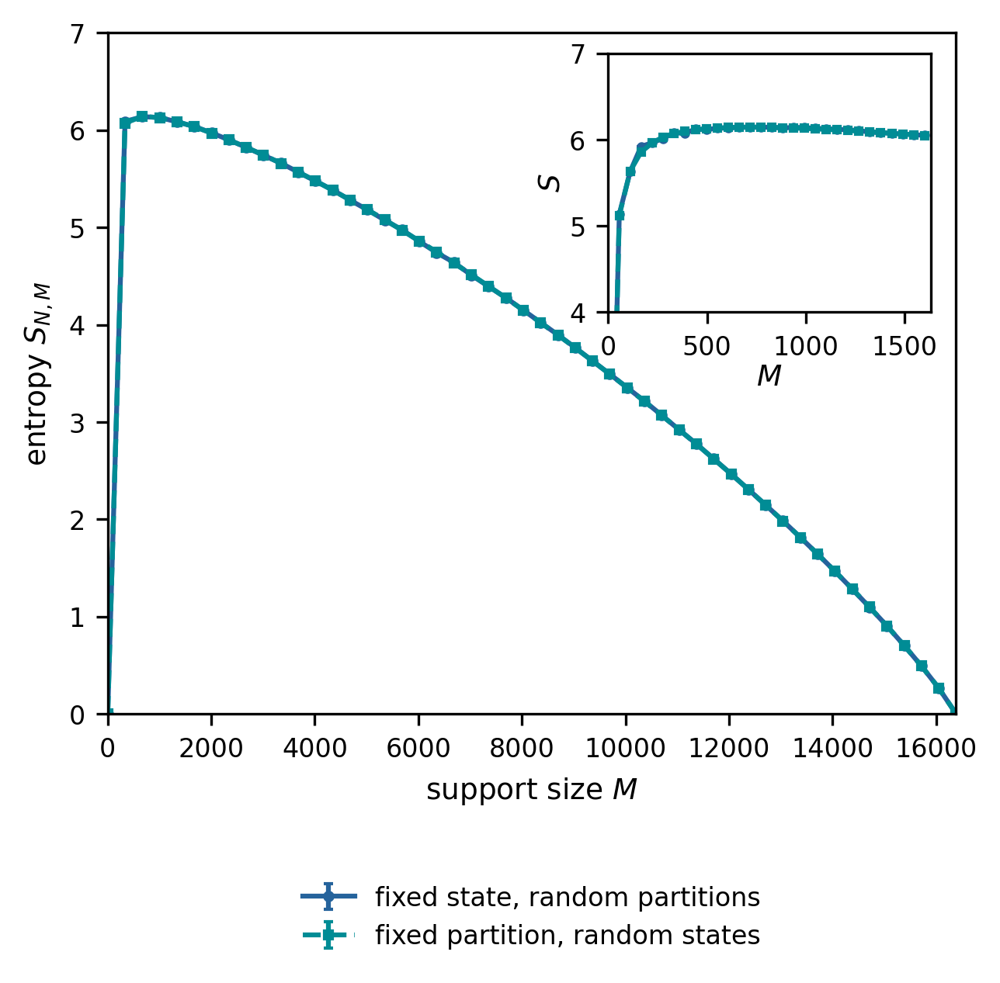

# Subset states: support size and entanglement

How does entanglement change when an equal-positive-amplitude quantum state occupies more computational-basis labels? A single label and the full basis both give product states. Random supports in between can give high bipartite entanglement.

This repository contains exact finite-ensemble formulas, numerical experiments, and released evidence for that question. **The exact mean-state and purity results survive the September 2026 sanity check. The asymptotic location of the von Neumann entropy maximum and the novelty of the revised research contribution remain unresolved.**

The related public preprint is [*Arithmetic sequences as quantum states* (2025), arXiv:2501.06292v1](https://arxiv.org/abs/2501.06292v1), by Ruge Lin, Germán Sierra, and José I. Latorre. “Support-size entanglement trajectories of random subset states” was the working title of a later revision; it is not the title of the current arXiv record checked on 22 September 2026.

## Read the project

| Document | Purpose |
|---|---|
| [Research notes](docs/RESEARCH.md) | Definitions, exact formulas and proofs, approximations, and figures |
| [Sanity check](docs/SANITY_CHECK.md) | Findings, corrections, and limits of the validation |
| [Provenance](PROVENANCE.md) | What the released data can and cannot substantiate |
| [Reproducibility](docs/REPRODUCIBILITY.md) | Commands, environments, and computational costs |
| [References](docs/REFERENCES.md) | Verified primary sources and the open novelty question |

All research prose is Markdown with plain-text or Unicode mathematics. There is no TeX source, bibliography build, or PDF workflow. Python code, CSV evidence, PNG figures, and machine-readable metadata retain their useful formats.

## What is established?

For an even number of qubits n, write N = 2ⁿ and d = 2^(n/2). Choose M distinct basis labels uniformly, assign each amplitude 1/√M, and split the qubits into two fixed halves.

| Result | Status |
|---|---|
| Exact ensemble-mean reduced state and average purity | Derived by counting; independently checked on all nonempty supports at n = 4 |
| Mean entropy at least n/2 − 1 − o(1), for M = cN^γ and 1/2 < γ < 3/4 | Consequence of the exact purity formula, for fixed c > 0 |
| Purity-minimizing support M = 2^(−1/3)N^(2/3) + O(1) | Analytic result; does not locate the von Neumann entropy maximum |
| Rise–peak–fall curves and retained peak estimates through n = 30 | Finite numerical evidence; original global-search records are incomplete |
| Hypergeometric diagonal-entropy bound and low-bit residue ceiling | Exact bounds with stated ensemble/cut assumptions |
| Almost-prime deficits after matching cardinality and residues | Finite comparisons at n = 14; no unique arithmetic fingerprint established |



This figure summarizes sampled finite systems. It is not a concentration theorem or an asymptotic scaling result.

## Run the checks

```bash
python3 -m venv .venv
source .venv/bin/activate
python -m pip install -r requirements.txt
python scripts/run_smoke_tests.py
python scripts/final_scientific_validation.py
python scripts/check_repository.py
```

Redraw all seven figures from released CSV files, without repeating simulations:

```bash
python scripts/reproduce_publication_figures.py
```

The historical command name is retained for compatibility. New outputs go under `generated/`; the released evidence stays in `data/` and `outputs/`. See [reproducibility](docs/REPRODUCIBILITY.md) for reduced simulations and expensive runs.

## Scope and citation

This is a research repository, not a submission-readiness certificate. The original global searches, especially n = 22–30, have not been reconstructed. Small changes in fitted slopes when dropping those rows do not resolve that provenance gap. Broader novelty claims require comparison with existing sparse-state and fixed-size subset-state results.

Use [CITATION.cff](CITATION.cff) for the public preprint, and cite a specific repository commit when using this revised implementation or data. The existing [MIT license](LICENSE) and author attribution are preserved.
